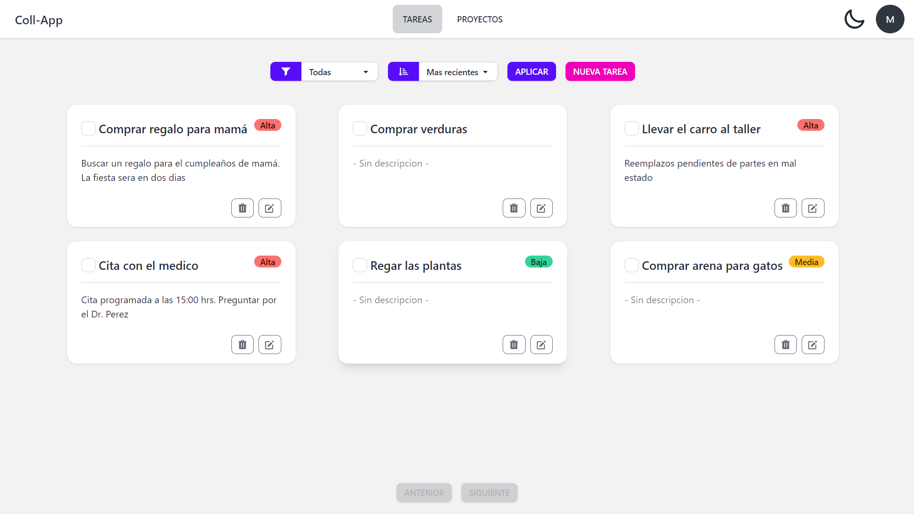
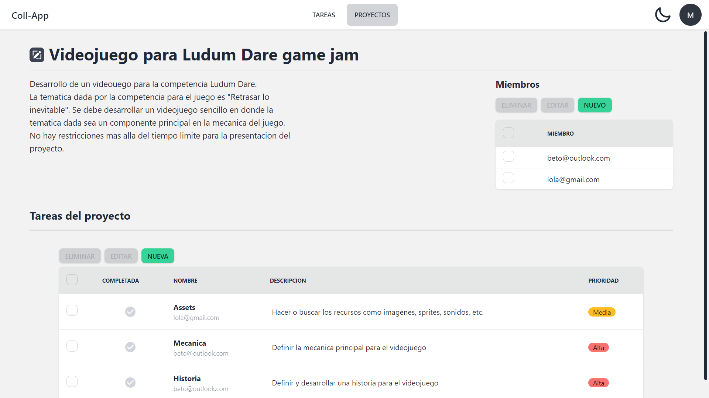

# Coll-App

Aplicación web que permite gestionar tareas, tanto de forma individual, como también de forma colaborativa mediante "Proyectos". 

## Tecnologías usadas
### Frameworks y librerías

- [Angular](https://angular.io/)
- [Angular Fire](https://github.com/angular/angularfire)
- [Firebase SDK](https://github.com/firebase/firebase-js-sdk)
- [Tailwind CSS](https://tailwindcss.com/)
- [DaisyUI](https://daisyui.com/)

### Servicios

- [Firebase](https://firebase.google.com/)

